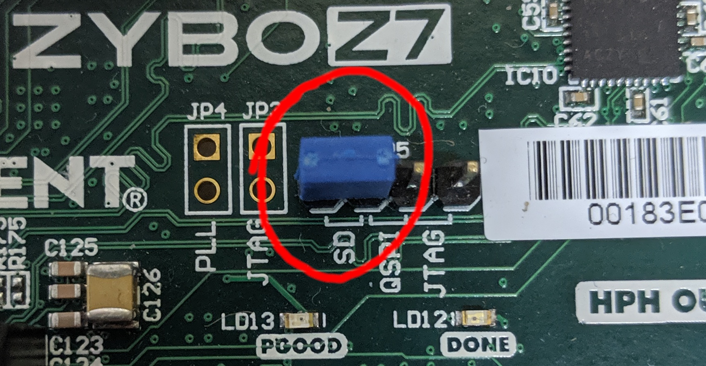
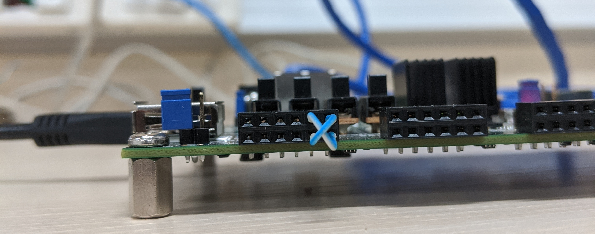
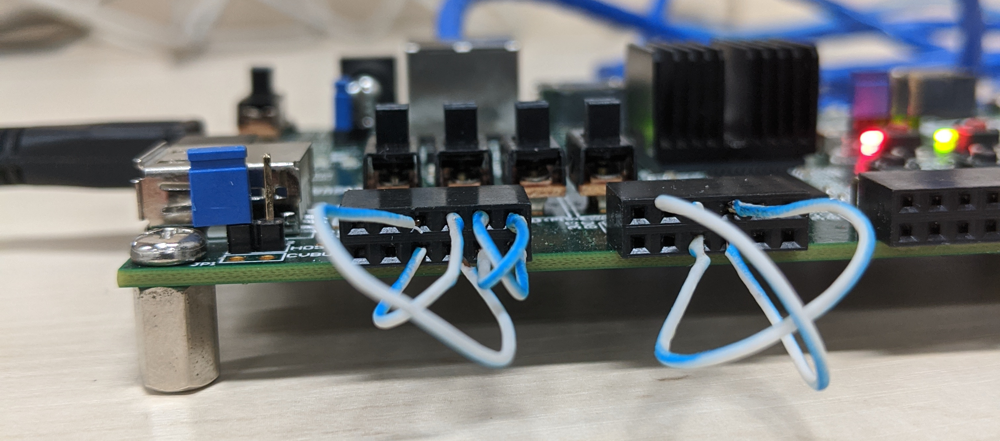

# Introdução

Este documento é um guia de como utilizar a placa Zybo Z7-20 para colocar o seu projeto final para funcionar em hardware real.


# Ligando e acessando a placa

A placa pode ser alimentada pela USB. Ela deve ter vindo com um cartão MicroSD com o Arch Linux instalado. Caso você precise gerar seu próprio cartão SD, baixe os arquivos para serem gravados com o [sdcard_download.sh](sdcard_download.sh) e, em seguida, formate o cartão com o [sdcard_format.sh](sdcard_format.sh).

Assegure-se que a placa esteja configurada para bootar do SD:



Para acessar o sistema da placa, há duas opções:

 * Pela própria USB. Se você tiver ligado a placa a um computador, execute:
   ```bash
   screen /dev/ttyUSB1 115200,cs8,-parenb,-cstopb
   ```
   Se não aparecer nada na tela, aperte ENTER.

   Para encerrar a sessão, pressione as teclas **Ctrl A** e, depos de soltá-las, pressione a tecla **K** e, por fim, **Y**.

   Se você estiver usando Windows, use o HyperTerminal ou algum programa similar. Apenas note que a placa expõe duas portas seriais pela USB, e você deve acessar a segunda dentre elas. Confira se a velocidade está configurada para 115200 bits por segundo.

 * Pela rede. Ligue a porta Ethernet da placa a alguma rede que tenha DHCP. Descubra qual endereço IP a placa pegou na rede (por exemplo, acessando antes pelo método da porta USB e usando o comando `ifconfig` ou o comando `ip addr`). Acesse via SSH:
   ```bash
   ssh alarm@endereco_ip
   ```

O usuário é `alarm` e a senha também é `alarm` (acredite se quiser, essa é a sigla de *Arch Linux on ARM*). Esse usuário tem permissão para usar `sudo`.


# Mantendo várias abas de terminal

É muito útil ter vários terminais para executar diferentes comandos ao mesmo tempo, mas se você estiver acessando a placa via USB, só vai conseguir abrir uma única sessão com a placa.

Para resolver esse problema, você pode usar o `tmux`. Uma vez executado o `tmux`, você pode:

 * Criar novas *abas* no terminal pressionando as teclas **Ctrl B** e, depois de soltá-las, pressionando a tecla **C**.

 * Alternar entre abas pressionando **Ctrl B** e, depois de soltá-las, pressionando o número da aba (a contagem começa em 0).

Para fechar uma aba, basta fechar qualquer programa que esteja executando nela e dar `exit` no terminal. Depois de fechar todas as abas, o `tmux` é encerrado.


# Hardware da placa

O FPGA da placa foi configurado para disponibilizar 8 linhas (portas) seriais. A figura abaixo mostra os pinos que podem ser usados:


**Atenção**:

 * Para evitar curto-circuito, **nunca** conecte nada aos pinos de alimentação (em vermelho).

 * Se você for conectar duas placas entre si, conecte antes os terras das placas (usando qualquer um dos pinos de terra, em verde), para garantir que o terra de todas as placas esteja no mesmo potencial elétrico.

 * Pinos de recepção (RX, em ciano) só devem ser conectados a pinos de transmissão (TX, em amarelo) e vice-versa.

Em resumo, para conectar duas placas entre si, você precisa de três pedaços de fio: um para o terra, um para ligar o RX de uma no TX da outra, e outro para ligar o RX no TX da outra.

Para fazer um teste ligando duas portas da mesma placa entre si (esse tipo de teste é chamado de *loopback*, pois a transmissão da placa volta para ela mesma), bastam dois fios: um para conectar um RX de uma porta no TX de outra, e outro para conectar o TX da porta no RX da outra.

O FPGA da placa tem filas implementadas em hardware tanto para transmissão como para recepção. No caso da transmissão, as filas são independentes (uma para cada porta). No caso da recepção, os bytes recebidos de todas as portas são agregados em uma única fila. Para garantir que todas as portas tenham a mesma prioridade, o hardware tem um escalonador *round-robin* que coleta um byte de cada porta por vez. Se você tiver curiosidade de ver como isso foi implementado, o código está disponível [neste link](https://github.com/thotypous/zybo-z7-20-uart/blob/master/Top.bsv).


# Usando a camada física

Copie para o seu projeto o arquivo [camadafisica.py](camadafisica.py). Ele funciona como um *driver* que acessa o hardware do FPGA.

Para inicializar o *driver* no seu código:

```python
from camadafisica import ZyboSerialDriver
driver = ZyboSerialDriver()
```

Você tem a opção de fazer alguma das duas operações a seguir com cada uma das portas seriais:

 * Obter um objeto que representa a linha serial, para utilizá-la no seu código Python, em conjunto com a sua implementação das camadas da rede.

   ```python
   linha_serial = driver.obter_porta(numero_da_porta)
   ```

   Note que o método `enviar` da `linha_serial` é bloqueante. Ou seja, se os dados enviados excederem a capacidade da fila de transmissão e forem enviados a uma taxa superior à taxa de transmissão, o programa será *pausado* até que seja possível enviar mais bytes. Em outras palavras, os bytes nunca serão perdidos por falta de espaço na fila. Escolhemos esse comportamento para dar menos trabalho para você colocar seu protótipo para funcionar, mas é importante refletir a respeito das implicações dessa decisão!

 * Expor a linha serial para o Linux, para utilizá-la com ferramentas do Linux, por exemplo conectando-a à implementação de camadas de rede do próprio Linux.

   ```python
   pty = driver.expor_porta_ao_linux(numero_da_porta)
   ```

   O nome do *device* criado no Linux fica disponível no atributo `pty.pty_name`.

Lembrando que há 8 portas disponíveis, portanto o `numero_da_porta` deve ser um inteiro de 0 a 7.


# Montando e testando um servidor TCP

O arquivo [exemplo_servidor.py](exemplo_servidor.py) contém um servidor TCP de eco (ou seja, que envia de volta os mesmos dados que forem recebidos).

Para testá-lo sem precisar de nenhum hardware externo à placa, faça a seguinte ligação:



Note que essa ligação conecta fisicamente as portas 4 e 5 entre si. O código usa a porta 4 em conjunto com as camadas de rede implementadas por você, e expõe a porta 5 para ser usada com as camadas de rede do Linux.

Dentro de uma aba do `tmux`, execute `./exemplo_servidor.py`.

Copie os comandos exibidos na tela. Execute o comando envolvendo o `slattach` em outra aba do `tmux`.

Por fim, execute os demais comandos em uma terceira aba do `tmux`.


# Montando e testando um roteador

O arquivo [exemplo_roteador.py](exemplo_roteador.py) contém um roteador. Note que ele só requer que você tenha implementado as camadas de rede e de enlace.

Para testá-lo sem precisar de nenhum hardware externo à placa, faça a seguinte ligação:



Note que essa ligação conecta fisicamente a porta 2 com a 3, a 4 com a 5 e a 6 com a 7. O código usa as portas 2, 4 e 6 em conjunto com as camadas de rede implementadas por você, e expõe as portas 3, 5 e 7 para serem usadas com as camadas de rede do Linux.

Dentro de uma aba do `tmux`, execute `./exemplo_roteador.py`.

Copie os comandos exibidos na tela. Crie três novas abas no `tmux`, uma para cada comando envolvendo `slattach`.

Por fim, execute os demais comandos em uma quinta aba do `tmux`.

Um pouco de explicação sobre o que os comandos significam:

 * O comando `ifconfig` serve para configurar o endereço IP de cada interface de rede exposta ao Linux. Informamos também o IP que está na outra ponta do enlace ponto-a-ponto (no caso, `192.168.122.1`, que é o endereço que escolhemos para nosso roteador em Python) e o tamanho máximo do *payload* do quadro (MTU).

 * O comando `ip route` serve para configurar a tabela de encaminhamento do Linux.

 * O comando `ip netns` serve para criar e gerenciar *namespaces* de rede no Linux. Os *namespaces* são formas de virtualizar a rede, criando espaços isolados que funcionam como se fossem outras máquinas. Note que deixamos a interface `sl0` na máquina principal, mas criamos *namespaces* `ns1` e `ns2` para as interfaces `sl1` e `sl2`, que funcionam como se fossem uma segunda e uma terceira máquina. Assim, é possível forçar datagramas destinados a essas interfaces a realmente passarem pelo roteador. Curiosidade: é assim que Docker e outras tecnologias de contêineres gerenciam internamente a rede.

Se tudo estiver funcionando (e sem mau contato), você conseguirá pingar os outros endereços IP:

* `ping 192.168.124.1`

* `ping 192.168.125.1`

Se a sua implementação de camada de rede estiver passando em todos os testes, ou seja, se você tiver implementado o *ICMP Time exceeded*, você deve ser capaz de utilizar, também, o utilitário `mtr` para traçar sua rota até esses endereços:

```
$ mtr 192.168.124.1
HOST: alarm                       Loss%   Snt   Last   Avg  Best  Wrst StDev
  1.|-- 192.168.122.1              0.0%    10   15.1  15.2  15.1  15.3   0.1
  2.|-- 192.168.124.1              0.0%    10   34.5  34.4  34.2  34.7   0.2

$ mtr 192.168.125.1
HOST: alarm                       Loss%   Snt   Last   Avg  Best  Wrst StDev
  1.|-- 192.168.122.1              0.0%    10   15.2  15.3  15.2  15.9   0.2
  2.|-- 192.168.125.1              0.0%    10   34.3  34.4  34.0  34.7   0.2
```

Note o endereço IP do roteador em Python (`192.168.122.1`) aparecendo como primeiro salto da rota.


# Resolução de problemas

## Minha implementação de TCP está recebendo dados corrompidos

Muito provavelmente a sua implementação de TCP não deve estar verificando o *checksum* dos segmentos recebidos, pois essa verificação não era exercitada pelos testes automatizados.

O motivo para não termos exercitado essa verificação até agora é que, devido a muitas placas de rede hoje terem aceleração via hardware para o cálculo do *checksum*, o padrão do Linux é deixar esse *checksum* zerado. Por causa disso, testes que fizéssemos com *raw sockets* falhariam quando recebêssemos os segmentos montados pelo Linux.

Como agora estamos usando SLIP e o Linux sabe que o hardware da porta serial não dispõe de nenhuma aceleração desse tipo, não existe mais esse problema. Para tornar sua implementação de TCP capaz de detectar erros de *checksum*, acrescente as seguintes linhas:

```python
        pseudohdr = str2addr(src_addr) + str2addr(dst_addr) + \
            struct.pack('!HH', 0x0006, len(segment))
        if calc_checksum(pseudohdr + segment) != 0:
            print('descartando segmento com checksum incorreto')
            return
```

logo após a verificação da porta de destino, que já existia no código:

```python
        if dst_port != self.porta:
            # Ignora segmentos que não são destinados à porta do nosso servidor
            return
```

## Após ocorrer alguma exceção, os protocolos começam a se comportar de forma estranha

Quando utilizamos `asyncio` e ocorre uma exceção no nosso código Python em meio ao tratamento de um evento, o processo não é encerrado. O tratamento do evento atual é interrompido no ponto em que ocorreu a exceção e, em seguida, o processo fica aguardando ocorrer o próximo evento (por exemplo, recebimento de mais dados).

Se, para manter a consistência, o seu código necessitar fazer alguma alteração de estado após chamar código externo (*callback*), tome cuidado com isso.

Por exemplo, na minha implementação de SLIP eu tinha um trecho de código assim:

```python
self.callback(self.buf)
self.buf = b''
```

O problema disso é que se ocorrer uma exceção na chamada `self.callback`, a linha de baixo, que torna o `self.buf` vazio, nunca vai executar. Para resolver esse problema, use nosso velho amigo, o bloco `try`/`except`. Sugiro que você **nunca** na sua vida deixe um bloco `except` vazio. Se quiser ignorar a exceção, é útil mesmo assim mostrá-la na tela, para facilitar a depuração do código. No exemplo acima, ficaria:

```python
try:
    self.callback(self.buf)
except:
    import traceback
    traceback.print_exc()
self.buf = b''
```

Essa situação poderia ter sido aferida pelos testes automatizados, mas realmente escapou! Desculpe se vocês tiverem que corrigi-la somente agora.
